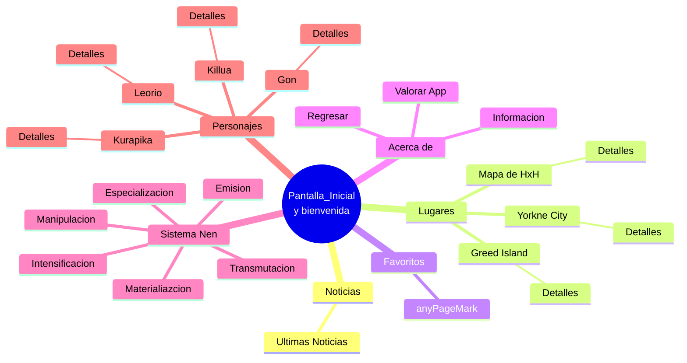

# Hatsu x Hatsu
---
## Descripción

Hatsu x Hatsu es una app que consiste en brindar información sobre el sistema de poder del anime Hunter x Hunter, incluyendo los personajes, lugares, las clases nen y sus detalles. Se 

## Datos del creador

- **Nombre**: Vicente Farías Piña

- **Universidad**: Universidad de Talca.

- **Carrera**: Ingeniera en desarrollo de videojuegos y realidad virtual.

- **Modulo**: Programacion para dispositivos moviles.

- **Profesor**: Manuel Moscoso.

---

---

## ¿Que es el nen?
El **nen** es una técnica que permite a un ser vivo usar y manipular su propia energía vital (conocida como Aura). La palabra "Nen" también se puede utilizar en una conversación para referirse al aura.
Podemos verlo como una técnica que permite a un usuario viviente usar y manipular su propia aura vital. Esta técnica es la base de muchos desarrollos sobrenaturales en el mundo de Hunter x Hunter.

## Funcionalidades del proyecto

La app permite navegar entre las distintas pantallas que incluyen, tipos de nen, lugares y personajes del manga.

Al inicio de la aplicación se verán opciones en la barra lateral, en las que se podrá seleccionar:
- Home
- Tipos de Nen
- Lugares
- Personajes
- Favoritos
- Configuracion
- About

De estas opciones, al pulsarlas se desplegará una nueva pantalla.

Al seleccionar la opcion de **personajes** se mostrará imágenes de algunos personajes con sus respectivos nombres.

En los **Lugares** se podra ver distintas ubicaciones vistas en el anime.

En ambos casos se podra pulsar encima de ellas y se abrirá el detalle respectivo de la opción elegida con una breve descripción e información relevante.

---
## Flujo de uso

- Al iniciar, se mostrara una pestaña con un botón de ingreso, posteriormente se mostrará la pantalla principal, la cual mostrará las ultimas noticias de Hunter x Hunter en la aplicación. 
En la esquina superior izquierda se desplegará una barra lateral con distintas opciones.
- Cada opción abre una nueva pantalla (excepto si esta en esta misma):  
  - **HOME**: Lleva al usuario a la pantalla principal al pulsar.  
  - **Tipos de Nen**: Muestra información relevante sobre qué es el Nen, cada uno con detalle al pulsar.  
  - **Lugares**: Muestra ubicaciones del anime, con detalle e información relevante.  
  - **Personajes**: Listado de personajes, cada uno con detalle al pulsar.  
  - **Favoritos**: Aqui hay una lista con los favoritos del usuario, lo que funciona como un "acceso rápido".
  - **Configuraciones**: Configuraciones y preferencias principales de la App como temas y elección de light o dark mode.
  - **About**: Información sobre la aplicación y puntuación de la app.
  
## Capturas de pantalla

## 🔗 Links

[Repositorio](https://github.com/PinaMC/hatsuxhatsu)

[Github creador](https://github.com/PinaMC)

[Link drive](https://drive.google.com/drive/folders/1RJT3qBMVXmNhsZT3MO16P8m3ocQa5NCH?usp=sharing)

## Descargar la app

Puedes probar la aplicación descargando el APK:

[ Descargar APK (v1.0.0)](https://github.com/PinaMC/HatsuXHatsu/releases/download/descargas/HatsuXhHatsu.apk)

### Diagrama

